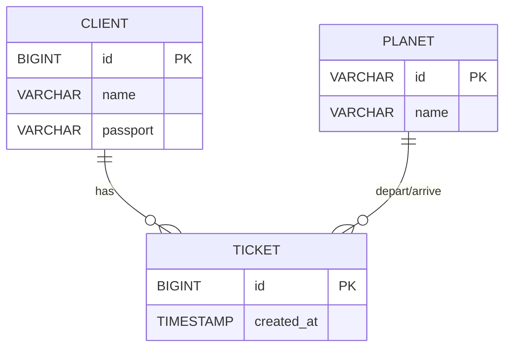

# SpaceTravel 🚀 – Interplanetary Passenger Transport Service

> **Course project – GoIT Java Developer programme (Modules 14‑15)**  
> Author: **Ruslan Lomaka**  

---

## Project Brief
SpaceTravel is a console‑based **CRUD demo** that manages passengers, planets, and tickets for an imaginary space‑line.  
It showcases **Hibernate 7**, **Flyway** migrations, layered service architecture, and negative‑path unit tests.

| Entity  | Purpose                                    | Key Fields |
|---------|--------------------------------------------|------------|
| `Client`| Passenger / customer                       | `id`, `name`, `passport` |
| `Planet`| Departure or arrival planet                | `id`, `name` |
| `Ticket`| Booking linking client ⇄ planets           | `id`, `created_at`, `client`, `fromPlanet`, `toPlanet` |

---

## Tech Stack
* **Java 17**
* **Gradle 8** (wrapper included)
* **Hibernate 7.0.0‑Beta5**
* **Flyway 11.6**
* **H2 2.3**
* **JUnit 5**, **Mockito 5**
* **SLF4J 2.1‑alpha1**

Switch DB by editing `src/main/resources/hibernate.properties`.

---

## Database Design (Mermaid)


Flyway migrations:  
`V1__init.sql` – schema │ `V2__populate_db.sql` – seed data.

---

## Getting Started
```bash
git clone https://github.com/<your-user>/spacetravel.git
cd spacetravel
./gradlew clean build   # compiles + tests + runs Flyway
./gradlew run           # launches console demo
```

On first launch you should see:
```
Flyway ... Successfully applied 2 migrations
...
Planet saved successfully.
```

---

## CRUD Services
| Service | Notes |
|---------|-------|
| `ClientCrudService`  | create / read / update / delete with passport uniqueness |
| `PlanetCrudService`  | prevents duplicate planet IDs |
| `TicketCrudService`  | validates non‑null & existing client/from/to before save |

Negative‑path unit tests guarantee invalid tickets never reach the DB.

---

## Implementation Highlights
* **Entity relationships** – `Client` @OneToMany → `Ticket`; `Ticket` @ManyToOne → `Client`, `fromPlanet`, `toPlanet`.
* **Validation logic** in `TicketCrudServiceImpl.save()` rejects null or non‑existent refs.
* **6 JUnit 5 + Mockito tests** cover all failure scenarios, fully isolated from the DB.
* **Flyway bootstrap** runs inside `HibernateUtil` static block—schema is always up‑to‑date.

---

## Project Structure
```
src/
 ├─ main
 │   ├─ java
 │   │   └─ space_travel/
 │   │        ├─ entity/
 │   │        ├─ service/
 │   │        ├─ impl/
 │   │        └─ exception/
 │   └─ resources
 │       └─ db/migration/
 └─ test
     └─ java/space_travel/impl/
```

---

## Roadmap / TODO
- [ ] Replace console layer with Spring Boot MVC controllers
- [ ] Add RESTful endpoints + Swagger
- [ ] Dockerise with Postgres for production profile
- [ ] Pagination & sorting on list endpoints

---

## License
Released under the **MIT License**. See `LICENSE`.
